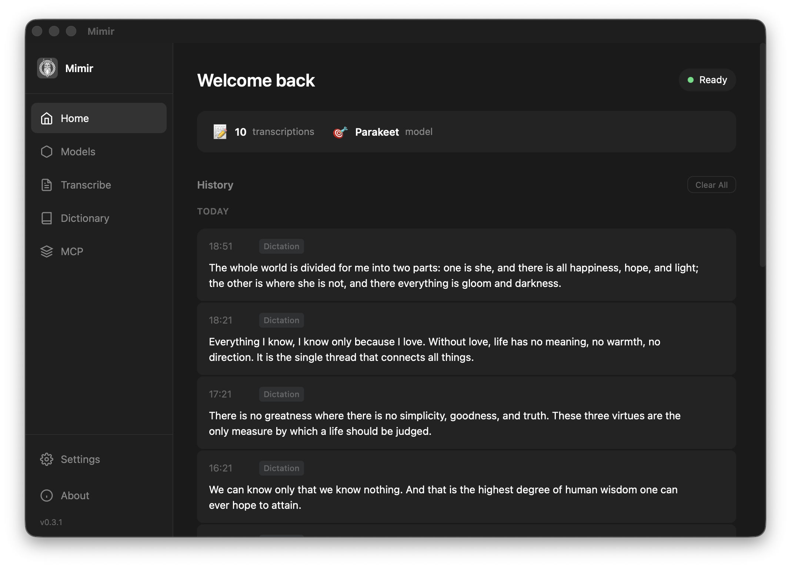

<p align="center">
  
</p>

<h1 align="center">Mimir</h1>

<p align="center">
  <strong>Offline voice-to-text for macOS.</strong><br>
  Speak, friend, and enter.
</p>

<p align="center">
  <a href="https://github.com/stensmir/mimir/releases/latest"></a>
  <a href="https://github.com/stensmir/mimir/releases"></a>
  <a href="https://github.com/stensmir/mimir/blob/main/LICENSE"></a>
  <a href="https://stensmir.github.io/mimir/"></a>
</p>

<p align="center">
  
</p>

---

## ✨ Features

- **🔒 100% Offline** — Your audio never leaves your machine. No cloud, no tracking, no analytics.
- **🎯 Two ASR Engines** — NVIDIA Parakeet (state-of-the-art, 25 languages) and OpenAI Whisper. Both run locally.
- **⌨️ Global Hotkey** — Press your shortcut in any app, speak, and text appears at your cursor.
- **🎙️ Wake Word** — Say "Mimir, start recording" — hands-free dictation.
- **📁 File Transcription** — Drop audio/video files (WAV, MP3, FLAC, OGG, MP4) and get text in seconds.
- **🤖 MCP Server** — Connect Mimir to Claude Desktop, Cursor, or any MCP-compatible AI agent.
- **⚡ Built with Rust** — Fast, lightweight, optimized for Apple Silicon.

## 📦 Download

<p align="center">
  <a href="https://github.com/stensmir/mimir/releases/latest/download/Mimir_0.3.3_aarch64.dmg">
    
  </a>
</p>

> **Windows & Linux** — coming soon.

## 🏗️ Architecture

```
┌─────────────────┐     ┌──────────────┐     ┌─────────────────┐
│                 │     │              │     │                 │
│  Global Hotkey  ├────►│              │     │  Parakeet ASR   │
│                 │     │              ├────►│  (ONNX Runtime) │
│  Wake Word      ├────►│    Mimir     │     │                 │
│                 │     │   (Rust)     │     ├─────────────────┤
│  File Drop      ├────►│              │     │                 │
│                 │     │              ├────►│  Whisper        │
│  MCP Server     ├────►│              │     │  (Local)        │
│                 │     │              │     │                 │
└─────────────────┘     └──────────────┘     └─────────────────┘
     Input               Tauri + CLI            ASR Engines
```

## 🤖 MCP Integration

Mimir provides a built-in MCP server for AI tool integration:

```json
{
  "mcpServers": {
    "mimir": {
      "command": "mimir",
      "args": ["mcp"]
    }
  }
}
```

Connect it to **Claude Desktop**, **Cursor**, or any MCP-compatible client. Transcribe audio right from your AI conversations.

## 🗺️ Roadmap

Mimir is currently in **early access**. We're actively fixing bugs and polishing the experience.

- [x] macOS (Apple Silicon)
- [x] Parakeet & Whisper engines
- [x] Global hotkey & wake word
- [x] MCP server
- [x] Auto-updater
- [ ] Windows support
- [ ] Linux support
- [ ] **Open source release** 🎉

> **Open source is coming.** We're stabilizing the codebase and squashing bugs first. Once the core is solid, we'll open everything up. Stay tuned — star the repo to get notified!

## 🌐 Website

Visit **[stensmir.github.io/mimir](https://stensmir.github.io/mimir/)** for more info, screenshots, and download links.

## 📬 Feedback

Found a bug? Have a feature request? **[Leave feedback](https://stensmir.github.io/mimir/feedback.html)** — help us make Mimir better.

---

<p align="center">
  <sub>Built with ❤️ and Rust. Designed for privacy.</sub>
</p>
